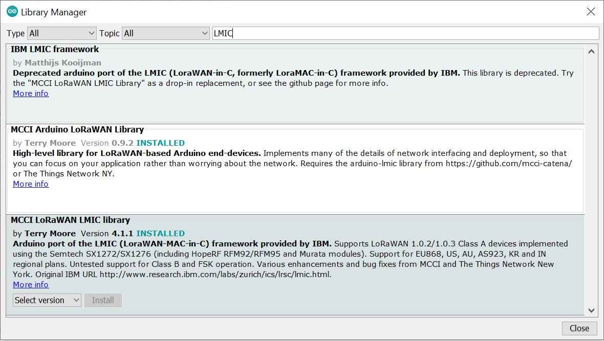

# Getting started with Raspberry Pi, IC880A, TTN

### Table of Contents
1. [Basic Requirements](#basic-requirements)
2. [Initialize The Raspbian OS](#initialize-the-raspbian-os)
3. [Connect The Circuit](#connect-the-circuit)
4. [Configure the Raspberry Pi](#configure-the-raspberry-pi)
5. [Test the gateway with the Packet Logger](#test-the-gateway-with-the-packet-logger)
6. [Setup the gateway on TTN](#setup-the-gateway-on-ttn)
7. [Setup the application and devices on TTN](#setup-the-application-and-devices-on-ttn)
8. [Send sample data using Arduino LMIC/MCCI](#send-sample-data-using-arduino-lmicmcci)
9. [Acknowledgements](#acknowledgements)

## Basic Requirements
For this guide, the following hardware is required:
- Raspberry Pi
- 4GB or higher MicroSD Memory Card
- IC880A-SPI LoRa Concentrator
- Jumper Wires (7x Male to Male)
- Ethernet Cable
- A Computer with an Ethernet Port
- Arduino Uno Board
- Dragino LoRa Shield

The following software (or any other functionally similar ones) is also required:
- Raspberry Pi Imager
- PuTTY
- Arduino

## Initialize The Raspbian OS
1. Insert a formatted MicroSD card into the appropriate port.
2. Install the applicable "Raspberry Pi Imager" from [here](https://www.raspberrypi.org/software) then open it.
3. For the OS, choose the recommended Raspberry Pi OS. For the storage, choose your MicroSD Card.
4. Click the Settings Icon that shows up.
   - Change the Image Customization Options to "to always use".
   - Make sure to enable SSH.
   - Set a password for the user 'pi'.
   - (Optional) Add the WLAN details (SSID, Password and Country) (This can be configured later).
   - Correctly configure the locales, if need be.
   - Click "Save".
   <picture>
     
   </picture>
5. Finally, select "Write".
   - After successful installation, remove the MicroSD card and place it into the Raspberry Pi.

## Connect The Circuit
Connect the following pins on the IC880A with the corresponding pins on the Raspberry Pi.

| iC880A pin | Raspberry Pi pin | Description     |
| ---------- | ---------------- | --------------- |
| 21         | 2                | 5V power supply |
| 22         | 6                | GND             |
| 13         | 17               | Reset           |
| 14         | 23               | SPI Clock       |
| 15         | 21               | MISO            |
| 16         | 19               | MOSI            |
| 17         | 24               | NSS             |
</table>
<sub>Note that the reset pin on the Raspberry Pi is 17 in this guide.</sub>

## Configure the Raspberry Pi
Make sure the Raspberry Pi has the MicroSD card inserted, then connect the power supply.
<br>Connect the Raspberry Pi to a computer with an Ethernet cable.
<br>Launch PuTTY, set the hostname to "raspberrypi.local", the port to 22, and the connection type to SSH, then click "Open".
<br><sub>If errors occur (host does not exist), try again a few times. Otherwise, ensure the connection is setup properly.</sub>
<p align="center">
   
   
</p>

After successful connection, run the following commands in order to install and update dependencies and libraries as well as installing git.
```
sudo apt-get update
sudo apt-get upgrade
sudo apt-get install git
```
Then run the following command and enable the SPI interface
```
sudo raspi-config
```

Finally, add the Wi-Fi interface in case it was not added during the Imaging process.
Execute the following command:
```
sudo nano /etc/wpa_supplicant/wpa_supplicant.conf
```
Modify the "country" field and add a "network" block with your Wi-Fi SSID and password. The file should look like this:
```
ctrl_interface=DIR=/var/run/wpa_supplicant GROUP=netdev
update_config=1
country=YOURCOUNTRY (US, GB, EG)
     
network={
    ssid="YOURSSID"
    psk="YOURPASSWORD"
    scan_ssid=1
}
```
<sub>If you have multiple networks that it can connect to, and you would like to choose a specific one, you can add "disabled=1" to all other networks instead of removing them.</sub><br>
Then press "Ctrl+X" to exit. "Y" to save the changes and "Enter" to overwrite the file.
<br>Next, modify the configuration file to allow WLAN:
```
sudo nano /etc/network/interfaces
```
Change (or add, if it does not exist) the first line to:
```
auto wlan0
```
Then append the following to the end of the file:
```
allow-hotplug wlan0
iface wlan0 inet dhcp
wpa-conf /etc/wpa_supplicant/wpa_supplicant.conf
iface default inet dhcp
```
Finally, reboot the Raspberry Pi and login once more.
```
sudo reboot
```

The Raspberry Pi should now be configured and ready to connect to a Network Server.

<br>It will later be important to obtain the MAC address of the gateway. To do that, just run the following command:
```
ifconfig
```
Then locate the "eth0" interface, and write down the digits after the "ether" line.
<br>This is the MAC address of the gateway's eth0 interface, which will be required everywhere from here on out.
<p align="center">
   
</p>
<br>In most cases, you will need to provide the "Gateway ID", which is 16 hexadecimal digits long. It is usually the same as the MAC address but with "fffe" appended to the middle of it.
<br>For example, if the MAC address is 11:22:33:44:55:66, then the Gateway ID would be 11:22:33:ff:fe:44:55:66.

## Test the gateway with the Packet Logger
In order to verify that the gateway and concentrator are correctly configured and are receiving LoRa packets, you can make use of the Packet Logger to view incoming packets.
<br>First, create a local folder and copy the contents of the Lora Gateway repository:
```
mkdir -p ~/LoRa/lora_gateway
cd ~/LoRa/lora_gateway
git clone https://github.com/Lora-net/lora_gateway.git
cd lora_gateway
make
```
In case you receive a "cannot find 'ld'" error, run the following command to install missing dependencies:
```
sudo apt-get install binutils
make
```
Next, reset the concentrator. Set the reset pin accordingly in the following command (Reset pin is 17 in this case):
```
./reset_lgw.sh start 17
```
Now, the gateway's MAC address needs to be configured in the "global_conf.json" file:
```
cd util_pkt_logger
sudo nano global_conf.json
```
Scroll down to the very end and replace the "gateway_ID" value with the gateway MAC address.
<br>Finally, in order to view all incoming LoRa packets, run the provided util_pkt_logger file:
```
sudo ./util_pkt_logger
```
<sub>
In case of "ERROR: failed to start the concentrator", this might be a problem with privileges.
<br>Execution as root seems to work fine as a temporary measure. You can login as root by entering the "sudo su root" command.
</sub>
<br>You should see all incoming LoRa packets being updated in real time. Whenever you would like to stop, press "Ctrl+C". The output should be saved in a csv file within the same directory.

## Setup the gateway on TTN
Now comes the time to setup our gateway and the server on 'The Things Network'.
<br>The first step is to clone the LoRa Basics Station repository and build it:
```
cd ~
git clone https://github.com/lorabasics/basicstation
cd basicstation
make platform=rpi variant=std ARCH=$(gcc --print-multiarch)
```
To verify that the build was successful, execute this command:
```
./build-rpi-std/bin/station --version
```
The output should be similar to the following:
```
Station: 2.0.6(rpi/std) 2022-03-26 17:43:16
Package: (null)
```
Then install the binary:
```
sudo mkdir -p /opt/ttn-station/bin
sudo cp ./build-rpi-std/bin/station /opt/ttn-station/bin/station
```
In order to obtain the gateway EUI, it is a combination of the MAC address and 'fffe'. Execute the following commands to export it to a variable (for ease in commands later):
```
export MAC=`cat /sys/class/net/eth0/address`
export EUI=`echo $MAC | awk -F: '{print $1$2$3 "fffe" $4$5$6}'`
echo "The Gateway EUI is $EUI"
```
Now is time to setup the gateway on TTN.
- First, using any device, access [the TTN cloud](https://console.cloud.thethings.network/) and select your server (Europe 1 in this case).
- Sign up for an account (or sign in, in case you already have one).
- Next, select "Gateways" and press the "Register Gateway" button.
- Add in the gateway EUI that we just obtained from the command line.
- Give it any ID/Name and set the Frequency plan appropriately (Europe 863-870 MHz in this case).
- Make sure to check 'Require authenticated connection' and 'Generate API key for LNS'
- You will be prompted to install a 'tc.key' file. **Make sure you install it and do not lose it.** It will be required later in order to connect the gateway, and the key cannot be re-obtained after this point.
- Voilà! You should see something similar to this in front of you:
</ul>
<p align="center">
   
<br>Now we return to the Raspberry Pi console to configure it to our newly created gateway.
<br>First, create a directory to store our configuration files:
```
sudo mkdir -p /opt/ttn-station/config
```
Then, create a 'tc.uri' file that contains the server address (eu1.cloud.thethings.network in this case).
```
echo 'wss://eu1.cloud.thethings.network:8887' | sudo tee /opt/ttn-station/config/tc.uri
```
Now, the 'tc.key' file that was downloaded needs to be placed into the config folder.
<br>For that end, you could:
   - Place the file into the '/opt/ttn-station/config' folder by mounting a flash device containing that file and moving it there:
   ```
   sudo mkdir /mnt/usb
   sudo mount /dev/sda1 /mnt/usb
   cd /mnt/usb
   cp tc.key /opt/ttn-station/config
   cd ~
   sudo umount /dev/sda1
   ```

   - Or, using any text editor (Notepad works), access the contents of the 'tc.key' file and copy the second line (LNS key) then execute the following commands (replacing API_KEY value with the copied LNS key):
```
export API_KEY="NNSXS.XXXXXXXXXXXXXXX.YYYYYYYYYYYYYYYY"
echo "Authorization: Bearer $API_KEY" | perl -p -e 's/\r\n|\n|\r/\r\n/g' | sudo tee -a /opt/ttn-station/config/tc.key
```

Next, create the 'tc.trust' file to check the LNS Server certificate.
```
sudo ln -s /etc/ssl/certs/ca-certificates.crt /opt/ttn-station/config/tc.trust
```
Then create a 'station.conf' file to hold the gateway information (Make sure the EUI variable exists, it was created in a previous step).
```
echo '
{
    /* If slave-X.conf present this acts as default settings */
    "SX1301_conf": { /* Actual channel plan is controlled by server */
        "lorawan_public": true, /* is default */
        "clksrc": 1, /* radio_1 provides clock to concentrator */
        /* path to the SPI device, un-comment if not specified on the command line e.g., RADIODEV=/dev/spidev0.0 */
        /*"device": "/dev/spidev0.0",*/
        /* freq/enable provided by LNS - only HW specific settings listed here */
        "radio_0": {
            "type": "SX1257",
            "rssi_offset": -166.0,
            "tx_enable": true,
            "antenna_gain": 0
        },
        "radio_1": {
            "type": "SX1257",
            "rssi_offset": -166.0,
            "tx_enable": false
        }
        /* chan_multiSF_X, chan_Lora_std, chan_FSK provided by LNS */
    },
    "station_conf": {
        "routerid": "'"$EUI"'",
        "log_file": "stderr",
        "log_level": "DEBUG", /* XDEBUG,DEBUG,VERBOSE,INFO,NOTICE,WARNING,ERROR,CRITICAL */
        "log_size": 10000000,
        "log_rotate": 3,
        "CUPS_RESYNC_INTV": "1s"
    }
}
' | sudo tee /opt/ttn-station/config/station.conf
```
The final configuration file that is needed is the 'start.sh' script which will run the concentrator.
<br>Modify the 4th line with your appointed reset pin if necessary.
```
echo '#!/bin/bash

# Reset iC880a PIN
SX1301_RESET_BCM_PIN=17
echo "$SX1301_RESET_BCM_PIN"  > /sys/class/gpio/export
echo "out" > /sys/class/gpio/gpio$SX1301_RESET_BCM_PIN/direction
echo "0"   > /sys/class/gpio/gpio$SX1301_RESET_BCM_PIN/value
sleep 0.1
echo "1"   > /sys/class/gpio/gpio$SX1301_RESET_BCM_PIN/value
sleep 0.1
echo "0"   > /sys/class/gpio/gpio$SX1301_RESET_BCM_PIN/value
sleep 0.1
echo "$SX1301_RESET_BCM_PIN"  > /sys/class/gpio/unexport

# Test the connection, wait if needed.
while [[ $(ping -c1 google.com 2>&1 | grep " 0% packet loss") == "" ]]; do
echo "[TTN Gateway]: Waiting for internet connection..."
sleep 30
done

# Start station
/opt/ttn-station/bin/station
' | sudo tee /opt/ttn-station/bin/start.sh
```
Finally, give the start script execute permissions and run it:
```
sudo chmod +x /opt/ttn-station/bin/start.sh
cd /opt/ttn-station/config
sudo RADIODEV=/dev/spidev0.0 /opt/ttn-station/bin/start.sh
```
If everything is successful, refresh the TTN gateway page and you should find that your gateway is connected and has pull/push requests arriving.

<br>As a final step, we will add the packet forwarder as a System Service so that it executes as soon as the Raspberry Pi boots.
```
echo '
[Unit]
Description=The Things Network Gateway

[Service]
WorkingDirectory=/opt/ttn-station/config
ExecStart=/opt/ttn-station/bin/start.sh
SyslogIdentifier=ttn-station
Restart=on-failure
RestartSec=5

[Install]
WantedBy=multi-user.target
' | sudo tee /lib/systemd/system/ttn-station.service
```
Enable and start the service:
```
sudo systemctl enable ttn-station
sudo systemctl start ttn-station
```
You can watch the arriving packets at any time with the following command:
```
sudo journalctl -f -u ttn-station
```

## Setup the application and devices on TTN
Now that the gateway is all setup, all that remains is sending data through our gateway to our own Application.
- First, login to [the TTN cloud](https://console.cloud.thethings.network/) once more, but this time go to "Applications" and click the "Add Application" button.
- Give the application an ID, a name and a description. Then click "Create application".
</ul>
The application is now all setup and ready. We now need to assign our end devices to it.

<p align="center">
  
</p>

<br>Before that, however, we should consider which activation method we would like our device to use.
<br>There are mainly two options: ABP (Activation By Personalization) and OTAA (Over The Air Activation).
<br>'The Things Industries' has a very good guide detailing the difference between the two modes, and I have linked it in the 'Acknowledgments' section below.

<br> - **OTAA (Over The Air Activation):**
   <br> For Over The Air Activation, we will require a JoinEUI, a DevEUI and an AppKey. The latter two can be generated by TTN, however, the JoinEUI should have been provided by the manufacturer or the server owner.
   - On the Application page, click on "End Devices" and "Add End Device".
   - Select your end device or choose "Enter end device specifics manually".
   - Choose the Frequency Plan (Europe 863-870 in this case).
   - Choose the LoRaWAN version (LoRaWAN Specification 1.0.3 in this case).
   - Choose the Regional Parameters Version (RP001 Regional Parameters 1.0.3 Revision A in this case).
   - Add your JoinEUI and confirm it.
   - Generate your DevEUI / AppKey and give an identifier for your device. (Make a note of these values as you will need them later. You will be able to reaccess them as necessary).
   - Click "Register End Device".
   </ul>
   <br>Voilà! Your OTAA device is now registered to the TTN Application and any data it transmits should show up here.

   <p align="center">
      
   </p>
   
<br> - **ABP (Activation By Personalization):**
   <br> For Activation By Personalization, we will require a JoinEUI, a DevEUI, a DevAddr, an AppSKey and an NwkSKey. All of them can be generated by TTN, however, the JoinEUI should have been provided by the manufacturer or the server owner.
   - On the Application page, click on "End Devices" and "Add End Device".
   - Select your end device or choose "Enter end device specifics manually".
   - Choose the Frequency Plan (Europe 863-870 in this case).
   - Choose the LoRaWAN version (LoRaWAN Specification 1.0.3 in this case).
   - Choose the Regional Parameters Version (RP001 Regional Parameters 1.0.3 Revision A in this case).
   - Expand the "Show advanced activation" list.
   - Set the Activation mode to 'Activation by personalization (ABP)'.
   - Add your JoinEUI and confirm it.
   - Generate your DevEUI / DevKey / AppSKey / NwkSKey and give an identifier for your device. (Make a note of these values as you will need them later. You will be able to reaccess them as necessary).
   - Click "Register End Device".
   </ul>
   <br>Voilà! Your ABP device is now registered to the TTN Application and any data it transmits should show up here.

   <p align="center">
      
   </p>


## Send sample data using Arduino LMIC/MCCI
This is the final step. Writing the Arduino program to transmit data using the LoRa protocol.
<br>First things first, two libraries need to be installed:
- MCCI Arduino LoRaWAN Library
- MCCI LoRaWAN LMIC Library
</ul>
To install them, launch Arduino, go to "tools" then "Manage Libraries".
<br>Search for LMIC then install the two libraries.
<p align="center">
   
</p>
After that, we will make use of the example files provided. These files transmit "Hello, World!".
<br>To open the example, click "File" then "Examples" and inside "MCCI LoRaWAN LMIC Library", select "ttn-abp" or "ttn-otaa" depending on which activation method you created the end device with on TTN.
<br>The first thing to change will be the pin mappings. They should follow the following image:

<p align="center">
   
</p>

After that, the example file instructs us to fill in any values marked with "FILLMEIN".
<br>These fields differ whether you are using OTAA or ABP.

<br> - **OTAA (Over The Air Activation):**
<ul>
       <li> AppEUI: Fill this in with your JoinEUI in little-endian format (AB:CD:EF -> {0xEF, 0xCD, 0xAB}). </li>
       <li> DevEUI: Fill this in with your DevEUI in little-endian format as well. </li>
       <li> AppKey: Fill this in with your AppKey in <strong>big-endian</strong> format (AB:CD:EF -> {0xAB, 0xCD, 0xEF}). </li>
</ul>
     <p align="center">
        
     </p>

<br> - **ABP (Activation By Personalization):**
<ul>
       <li> NwkSKey: Fill this in with your NwkSKey in <strong>big-endian</strong> format (AB:CD:EF -> {0xAB, 0xCD, 0xEF}). </li>
       <li> AppSKey: Fill this in with your AppSKey in <strong>big-endian</strong> format as well. </li>
       <li> DevAddr: Fill this in with your DevAddr in <strong>big-endian</strong> format as one integer (AB:CD:EF -> 0xABCDEF). </li>
</ul>
     <p align="center">
        
     </p>

Now connect an Arduino Uno Board with the Dragino LoRa Shield and verify then compile and install the code. Now, the board should be transmitting "Hello, World!" LoRa packets destined to your application.
<br>Log into your application on TTN and you should find that the packet arrives there.
<br>That is all. You now have a connection from an Arduino board to a TTN server. The next step would be to change the example data that is sent by default.

## Acknowledgements
- [The Things Industries - Setting up Raspberry Pi](https://www.thethingsindustries.com/docs/gateways/models/raspberry-pi/)
- [The Things Industries - ABP vs OTAA](https://www.thethingsindustries.com/docs/devices/abp-vs-otaa/)